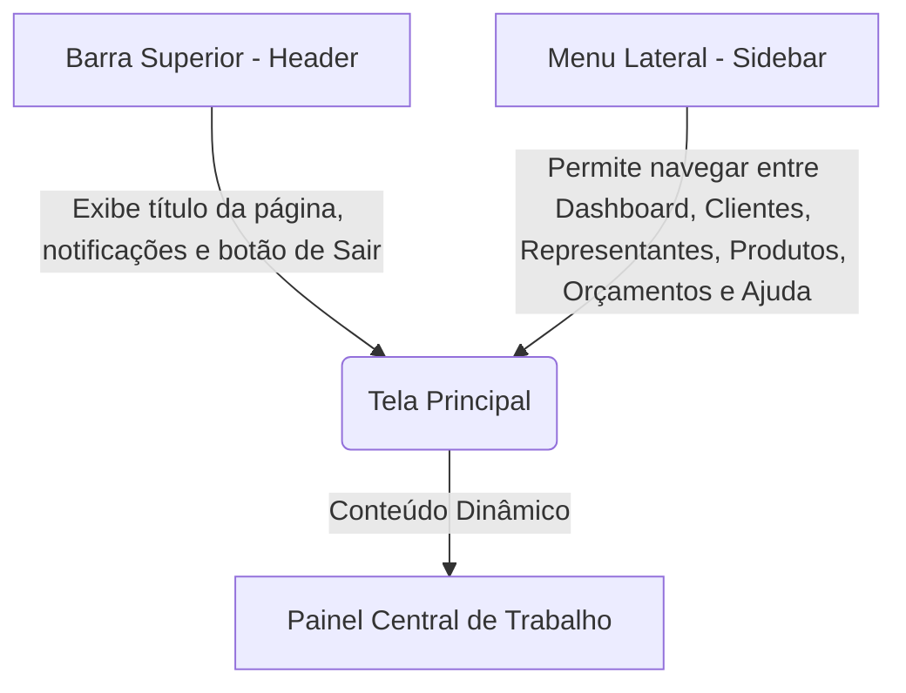

# Capítulo 00: Introdução e Funcionamento Geral do Sistema 🌐

Neste capítulo, você aprenderá as bases do sistema **ADS Representações**: como a tela se organiza, como navegar, onde as suas informações ficam guardadas de forma segura e por que o sistema é tão rápido.

---

## 🖥️ 1. Como a Tela é Organizada

O sistema possui uma estrutura muito simples dividida em três áreas principais:

1.  **Menu Lateral (Sidebar):** Fica no lado esquerdo da tela. Através dele, você acessa todas as seções (Dashboard, Clientes, Representantes, Produtos, Orçamentos e Ajuda). Em telas de celular, ele pode ser recolhido para liberar espaço.
2.  **Barra Superior (AppHeader):** Fica no topo da tela. Mostra em qual seção você está no momento (por exemplo, "Clientes"), exibe notificações relevantes e tem o botão para você sair do sistema de forma segura.
3.  **Área de Trabalho Central:** Onde as tabelas, formulários e botões aparecem. É aqui que você digita as informações e interage com o sistema.

---

## ☁️ 2. Onde as Minhas Informações Ficam Salvas?

Muitos usuários se perguntam: *"Se meu computador quebrar ou eu fechar o navegador sem querer, vou perder tudo?"* 

A resposta é **NÃO!** 

*   **Banco de Dados na Nuvem (Google Firestore):** Todas as informações digitadas por você são enviadas em tempo real e salvas de forma segura nos servidores do **Google (Firebase Cloud Firestore)**.
*   **Identificação Sequencial (ID):** Cada item cadastrado (seja um cliente, produto, representante ou orçamento) recebe um **número de identificação único e sequencial** (1, 2, 3, 4...). Esse número é gerado automaticamente pelo sistema de forma que nunca se repita e nunca haja "buracos" na numeração, facilitando a sua organização.

---

## ⚡ 3. O Sistema de Cache (Por que é tão rápido?)

Para evitar que você tenha que esperar o sistema buscar dados na internet toda vez que clica em uma tela diferente, nós usamos uma tecnologia de **Cache Local**.

*   **Como funciona:** Quando você faz login no sistema pela primeira vez no dia, o sistema baixa uma cópia temporária da lista de clientes, produtos e representantes e guarda no seu próprio navegador.
*   **Velocidade instantânea:** Ao pesquisar um produto ou abrir a lista de clientes, o sistema lê os dados desse cache local, fazendo com que as informações apareçam em menos de um segundo!
*   **Atualização inteligente:** Sempre que você adiciona, edita ou exclui alguma informação, o sistema envia a mudança para o banco de dados na nuvem e, logo em seguida, atualiza o cache local do seu navegador de forma automática.
*   **Tempo de Expiração (TTL):** Caso você fique muito tempo com a página aberta sem mexer, o cache é renovado automaticamente a cada **5 minutos** para garantir que você não veja informações desatualizadas se outro colega de trabalho cadastrar algo no sistema ao mesmo tempo.

---

## 📜 4. A Regra de Ouro dos Orçamentos (Snapshots Históricos)

Esta é uma das partes mais importantes do sistema e que evita muitos erros comerciais:

> [!IMPORTANT]
> **O Orçamento é um documento histórico e imutável.**
> Quando você cria um orçamento, o sistema faz uma "cópia em foto" (snapshot) dos dados do cliente, do representante e dos produtos exatamente como eles estavam cadastrados **naquele exato momento**.

*   **O que isso significa na prática?**
    *   Se hoje você emitir um orçamento para o Cliente A com o produto X custando **R$ 100,00**.
    *   Amanhã você alterar o cadastro do Produto X para custar **R$ 120,00** ou alterar o endereço do Cliente A.
    *   O orçamento emitido ontem **NÃO sofrerá alteração**. Ele continuará exibindo o preço de R$ 100,00 e o endereço antigo. Isso garante a segurança jurídica do seu negócio, impedindo que orçamentos antigos enviados aos clientes mudem de valor de forma oculta.
*   **E se eu quiser atualizar o orçamento antigo?**
    Caso precise atualizar dados de um orçamento antigo para refletir alterações recentes, você deve abrir o orçamento em modo de edição, realizar a alteração desejada e salvá-lo novamente de forma explícita.

---

## ❓ Perguntas Frequentes (FAQ)

**1. Posso usar o sistema sem internet?**
Não. Como os dados e autenticação de login residem no Google Cloud Firebase, você precisa de uma conexão ativa com a internet para abrir o sistema, fazer login e salvar novos registros. O cache ajuda a navegar mais rápido, mas não substitui a internet para gravação.

**2. O que acontece se duas pessoas editarem o mesmo cliente ao mesmo tempo?**
O sistema aplicará a alteração que for salva por último. O cache local de ambas as pessoas se ajustará no máximo após 5 minutos ou no próximo clique de atualização da tela.

---

### Botões de Ação Rápida
*   **[Ir para a Tela Inicial (Dashboard) 🏠](route://Home)**
*   **[Ver Lista de Orçamentos 📄](route://Orcamentos)**
*   **[Voltar para o Sumário da Ajuda 📖](file:///d:/Dev/Frontend/CurrentProjects/ads-representacoes/docs/manual/README.md)**
