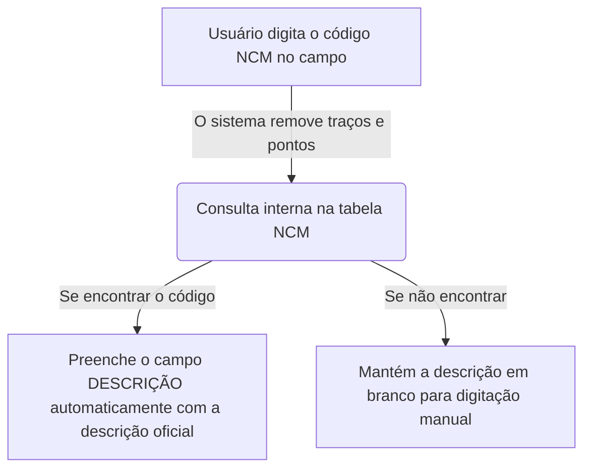

# Capítulo 03: Catálogo de Produtos 📦

O **Catálogo de Produtos** é onde você gerencia os materiais, peças e serviços que a ADS Representações oferece. Neste capítulo do manual, você aprenderá sobre o preenchimento automático pelo código NCM, como o sistema lida de forma segura com valores monetários e o fluxo completo de cadastro.

---

## 📋 1. O que é o Catálogo de Produtos?

É o inventário virtual do sistema. Em vez de você digitar o nome e o preço de um produto toda vez que for fazer um orçamento, você o cadastra uma única vez no Catálogo de Produtos. Assim, na hora de fazer o orçamento, basta selecioná-lo e o preço e a descrição padrão serão carregados automaticamente.

---

## 🗂️ 2. Tipos de Dados Aceitos e Formatos (Campos do Formulário)

Ao preencher o formulário de cadastro de produto, preste atenção nas regras de cada campo:

| Nome do Campo | Obrigatório? | O que digitar? | Comportamento e Formatação |
| :--- | :--- | :--- | :--- |
| **NCM** | **Sim (Obrigatório)** | Código NCM do produto (8 números). | Identifica a classificação fiscal da mercadoria. O sistema usa este código para buscar a descrição padrão (veja seção 3). |
| **ICMS (%)** | Não (Opcional) | Alíquota de imposto ICMS aplicável. | Exibe o símbolo `%` ao final. Aceita valores numéricos (Ex: `12`, `18`). |
| **Nome do Produto**| **Sim (Obrigatório)** | O nome comercial do produto. | Aceita texto livre. Ex: `Válvula Reguladora de Pressão 3/4` |
| **Qtd. em Estoque**| Não (Travado) | Campo desabilitado fixo em **0**. | Este sistema gerencia propostas e orçamentos de representação, portanto não controla estoque físico interno. |
| **Valor (Unitário)**| **Sim (Obrigatório)** | O valor de tabela do produto. | Formatação automática em Real (`R$`). Você digita apenas os números e o sistema adiciona o `R$`, os pontos e a vírgula. |
| **Descrição** | Não (Opcional) | Texto detalhado do produto. | Geralmente preenchido de forma automática pelo NCM (veja seção 3), mas aceita digitação de texto complementar. |

---

## 🔍 3. O Recurso de Busca Automática de NCM

O NCM (Nomenclatura Comum do Mercosul) é um código padrão usado pelo governo. O sistema ADS Representações possui uma **Tabela NCM oficial interna** com milhares de códigos cadastrados.

*   **Como funciona na prática:** Ao digitar ou colar o código NCM de 8 dígitos no formulário (Ex: `84811000` - Válvulas redutoras de pressão), o sistema pesquisa instantaneamente na tabela interna.
*   **Economia de tempo:** Se o código for localizado, o campo **Descrição** do formulário será preenchido automaticamente com o texto técnico oficial correspondente àquele NCM. Você não precisa digitar toda aquela descrição técnica enorme!
*   **Edição livre:** O campo descrição continua aberto. Caso precise complementar a descrição padrão da tabela NCM com detalhes comerciais do seu produto específico, basta clicar e escrever o que quiser.

---

## 💰 4. Armazenamento Seguro de Valores Monetários (Centavos)

Para garantir que o sistema nunca faça contas erradas ou arredonde valores de forma incorreta (um problema comum em sistemas digitais), nós usamos a técnica de **gravação em centavos**.

*   **Como funciona por trás dos panos:** Quando você cadastra um produto com o valor unitário de **R$ 12,50**, o sistema multiplica esse valor por 100 e salva no banco de dados como o número inteiro **`1250`**.
*   **Sem preocupação para o usuário:** Você não precisa se preocupar com isso! Na tela de cadastro e nos orçamentos, o valor é exibido normalmente como `R$ 12,50`. O sistema faz a conversão de entrada e saída sozinho de forma invisível.

---

## 🔄 5. O Fluxo de Trabalho Passo a Passo

### A. Como Acessar a Tela de Produtos
Clique no menu lateral esquerdo em **Produtos**. A tela mostrará a lista de todos os itens cadastrados com seu código NCM, nome, imposto (ICMS) e valor de tabela.

### B. Como Cadastrar um Novo Produto
1.  Na tela de produtos, clique em **Adicionar Produto** (ou no ícone `+` no canto superior direito).
2.  No formulário modal, digite primeiro o código **NCM**. O sistema fará a busca automática e preencherá a **Descrição** se encontrar.
3.  Preencha a alíquota do **ICMS** se aplicável.
4.  Digite o **Nome do Produto** (obrigatório).
5.  No campo **Valor (Unitário)**, digite o valor de tabela do produto. Exemplo: para R$ 1.500,00, basta digitar `150000` (os centavos são os últimos dois dígitos).
6.  Complemente a descrição se achar necessário.
7.  Clique em **Adicionar**.

### C. Como Pesquisar, Editar ou Excluir
*   **Pesquisar:** Na barra superior, você pode digitar o **Nome do Produto** ou o código **NCM** (com ou sem formatação).
*   **Editar:** Clique no ícone de lápis correspondente à linha do produto, faça as alterações nos campos (inclusive valor ou NCM) e salve.
*   **Excluir:** Clique no ícone de lixeira vermelha na linha do produto e confirme a exclusão no aviso. O produto será removido da base de dados e do cache local na hora.

---

## ❓ Perguntas Frequentes (FAQ)

**1. Mudar o preço de um produto no catálogo altera os orçamentos que já fiz no passado?**
**NÃO!** Conforme explicado no Capítulo 00, orçamentos antigos guardam um snapshot (cópia estática) dos dados de quando foram emitidos. A mudança no preço de tabela do catálogo de produtos só valerá para os orçamentos criados a partir do momento da mudança.

**2. O que fazer se o código NCM não preencher a descrição automaticamente?**
Isso significa que o código digitado pode estar desatualizado ou não consta na tabela simplificada embarcada no sistema. Sem problemas! Você pode simplesmente clicar no campo **Descrição** e escrever manualmente a descrição do produto. O cadastro funcionará normalmente.

---

### Botões de Ação Rápida
*   **[Ir para o Catálogo de Produtos 📦](route://Produtos)**
*   **[Voltar para o Sumário da Ajuda 📖](file:///d:/Dev/Frontend/CurrentProjects/ads-representacoes/docs/manual/README.md)**
