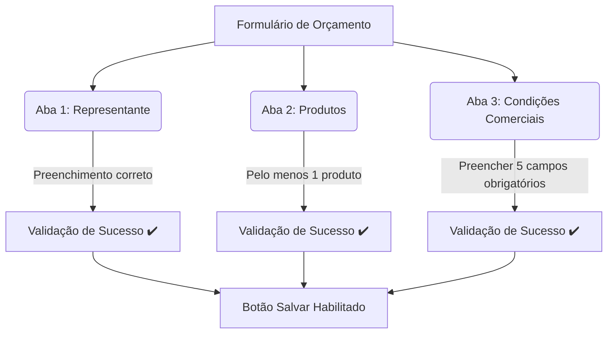

# Capítulo 04: Geração e Emissão de Orçamentos 📄

Esta é a seção central e mais completa do sistema **ADS Representações**. Aqui você aprenderá como funciona o formulário dinâmico em acordeão para criar orçamentos, personalizar preços por cliente, pré-visualizar a proposta antes de salvar e exportar para PDF.

---

## 📋 1. O que é a Seção de Orçamentos?

O Orçamento é a proposta comercial enviada ao cliente. Ele junta as informações de:
1.  Quem está vendendo (o **Representante** e o **Cliente** ao qual ele pertence).
2.  O que está sendo vendido (a lista de **Produtos**, suas quantidades e preços combinados).
3.  Quais as condições do negócio (prazos, pagamento, frete, impostos e validade).

Ao final do processo, o sistema gera uma folha timbrada oficial em PDF, pronta para ser enviada por e-mail ou WhatsApp.

---

## 🧭 2. Estrutura do Formulário Dinâmico (Acordeão em 3 Passos)

Para facilitar o preenchimento sem poluir a tela, o formulário de orçamento é organizado em um **Acordeão** com três abas sanfonadas. Você pode expandir ou recolher as seções clicando em seus títulos:

### Aba 1: Representante 👔
*   **O que fazer:** Digite o nome do **Representante** no campo de busca e selecione-o na lista de sugestões.
*   **Vínculo Automático:** Ao selecionar o Representante, o sistema identifica automaticamente a qual **Cliente (Empresa)** ele está vinculado e preenche os dados do cliente de forma invisível.
*   **Aviso:** O cadastro do cliente e do representante são vinculados. Se o representante escolhido não estiver associado a uma empresa no cadastro de origem, o orçamento não terá um cliente associado.

### Aba 2: Produtos 📦
*   **O que fazer:** Pesquise os produtos do catálogo digitando o **Nome** ou o **NCM** no campo de busca e clique sobre o produto na lista para adicioná-lo ao orçamento.
*   **Quantidade:** Defina a quantidade de cada item utilizando os botões de menos (`-`) e mais (`+`), ou digitando a quantidade diretamente no campo.
*   **Preço Customizado (Override):** 
    > [!TIP]
    > **Dica Comercial:** Você pode alterar o preço de um produto apenas para este orçamento!
    > No campo de valor unitário do produto na listagem do orçamento, apague o preço padrão e digite o novo preço combinado com o cliente. Essa alteração só afeta este orçamento em específico; o preço do catálogo de produtos continua intacto.
*   **Remover Produto:** Se adicionou um item errado, clique no ícone da lixeira vermelha na linha do produto para removê-lo.

### Aba 3: Condições Comerciais (Prazos e Observações) ⚙️
Nesta aba, você define as regras comerciais. O sistema possui **5 campos obrigatórios** na validação:
1.  **Prazo para Entrega (`estimatedDate`):** Ex: `A combinar` ou `20 dias úteis`.
2.  **Validade da Proposta (`maxDealDate`):** Ex: `15 dias úteis` ou `Até 30/08/2026`.
3.  **Garantia (`guarantee`):** Pré-preenchido com o texto padrão de garantia (você pode editar livremente).
4.  **Condição de Entrega (`shippingTerms`):** Menu de escolha entre **CIF** (frete por conta do emitente) ou **FOB** (frete por conta do destinatário).
5.  **Referência (`reference`):** O título da proposta ou projeto. Ex: `Proposta de Fornecimento de Válvulas`.

*   **Campos Opcionais:**
    *   **Condição de Pagamento (`paymentTerms`):** Ex: `28 dias de prazo` ou `À vista`.
    *   **Imposto (`tax`):** Pré-preenchido com o texto: `"NOS PREÇOS ACIMA JÁ ESTÃO INCLUSOS OS IMPOSTOS"`.

---

## 📊 3. Painel de Resumo Lateral (Live Validation)

Enquanto você preenche o orçamento, um **Painel de Resumo** flutua no lado direito da tela (em computadores) ou abaixo do formulário (em celulares). Ele mostra:

1.  **Valor Total Acumulado:** O valor atualizado em tempo real à medida que você adiciona produtos, altera quantidades ou customiza preços.
2.  **Status de Conclusão das Seções:** Exibe um visto verde `✔️` se a seção estiver completa ou um alerta vermelho `⚠️` se faltar preencher algum dado obrigatório.
3.  **Validação Geral:** O botão de **Salvar Orçamento** só ficará azul (habilitado) quando todas as três abas do acordeão estiverem verdes (preenchidas corretamente).

---

## 👁️ 4. Pré-visualização e Exportação de PDF

Antes de salvar o orçamento no banco de dados, você pode conferir o layout da proposta para garantir que as informações estão bem distribuídas.

1.  Com o formulário válido, clique no botão **Visualizar PDF**.
2.  Uma tela popup abrirá no centro exibindo o visual oficial do orçamento: a logomarca da empresa, cabeçalho de contato, tabela de produtos com NCM e valores somados, e as condições comerciais e assinaturas.
3.  Se encontrar algum erro de digitação, feche o popup, faça o ajuste no formulário e confira novamente.
4.  Se estiver tudo correto, feche o popup e clique em **Salvar Orçamento**.

---

## 🔄 5. O Fluxo de Trabalho Passo a Passo

### A. Como Criar um Novo Orçamento
1.  Acesse o menu lateral em **Orçamentos**.
2.  Clique no botão **Novo Orçamento** (ou atalho `+` no cabeçalho).
3.  **Passo 1 (Aba Representante):** Digite e selecione o representante.
4.  **Passo 2 (Aba Produtos):** Pesquise e adicione os itens. Configure as quantidades e altere preços unitários se necessário.
5.  **Passo 3 (Aba Condições Comerciais):** Preencha os prazos de entrega, validade da proposta, escolha CIF ou FOB e defina a referência.
6.  Confira no Painel de Resumo se todos os passos estão verdes.
7.  Clique em **Visualizar PDF** para a conferência visual.
8.  Clique em **Salvar Orçamento**. Você será redirecionado para a lista geral de orçamentos.

### B. Como Gerar o PDF de um Orçamento Gravado
1.  Na tela de lista geral de orçamentos, localize o orçamento desejado pelo ID ou pelo nome do cliente.
2.  Na linha do orçamento, clique no ícone do **documento PDF** (geralmente azul).
3.  A janela popup abrirá permitindo que você visualize e use as funções nativas do navegador para **Imprimir** ou **Fazer Download (Salvar no computador)** do arquivo PDF.

### C. Como Editar um Orçamento Existente
1.  Na lista geral de orçamentos, clique no ícone de lápis correspondente à linha do orçamento.
2.  O sistema carregará o formulário com todos os dados salvos anteriormente.
3.  Realize as alterações desejadas (adicionar/remover produtos, alterar prazos, etc.).
4.  Confira se a validação continua ativa.
5.  Clique em **Salvar Alterações**. O orçamento histórico é re-gravado com a nova data de modificação e os novos dados.

---

## ❓ Perguntas Frequentes (FAQ)

**1. O botão "Salvar" está desativado (cinza) e não consigo clicar. O que falta?**
Olhe para o **Painel de Resumo** no lado direito. Ele listará quais abas estão incompletas. Comumente, os usuários esquecem de preencher um dos **5 campos obrigatórios** da aba "Condições Comerciais" ou não adicionaram nenhum produto.

**2. Posso cadastrar um novo produto ou cliente diretamente da tela de orçamento?**
Não nesta tela. Se o representante, cliente ou produto que você precisa usar não aparecer na busca, você deve cancelar o orçamento atual, ir até a tela correspondente (Clientes, Representantes ou Produtos), realizar o cadastro lá e depois retornar para criar o orçamento. O novo cadastro aparecerá nas buscas na mesma hora devido ao sistema de atualização automática de cache.

---

### Botões de Ação Rápida
*   **[Criar Novo Orçamento Rápido ➕](route://Orcamentos/Adicionar)**
*   **[Ver Lista de Orçamentos 📄](route://Orcamentos)**
*   **[Voltar para o Sumário da Ajuda 📖](file:///d:/Dev/Frontend/CurrentProjects/ads-representacoes/docs/manual/README.md)**
